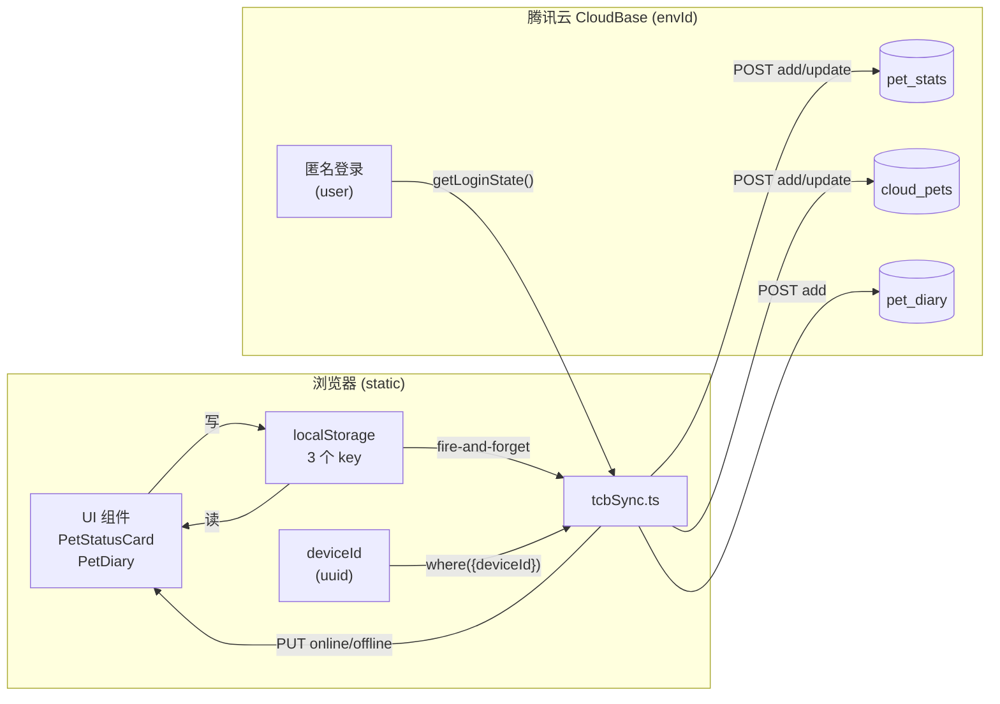
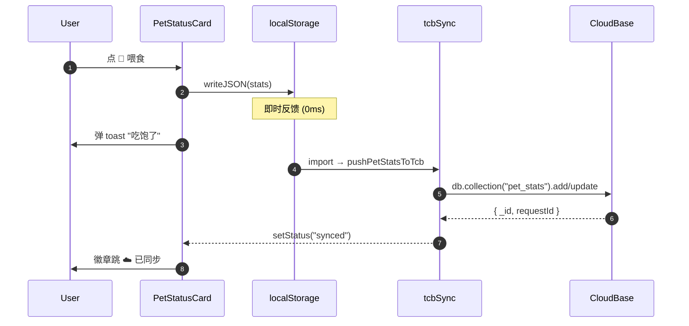
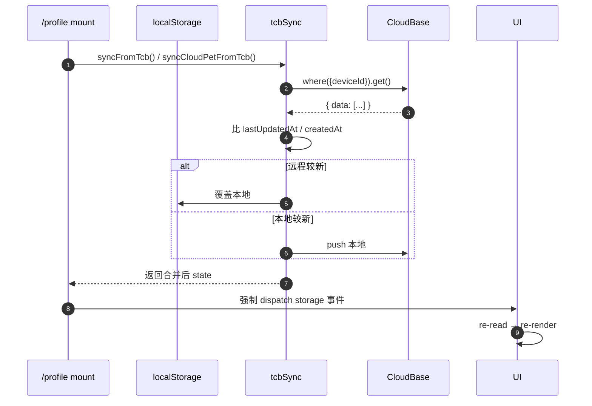
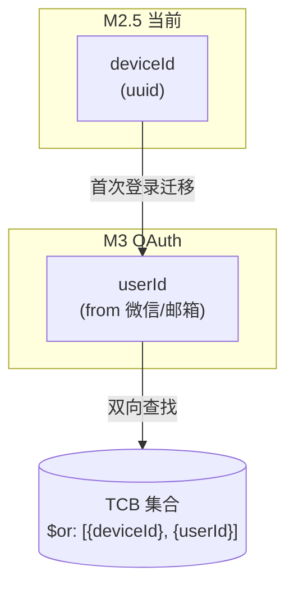
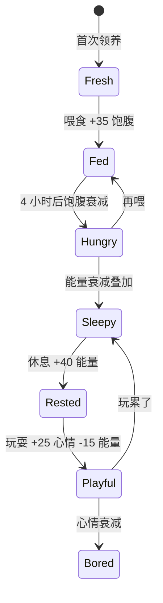
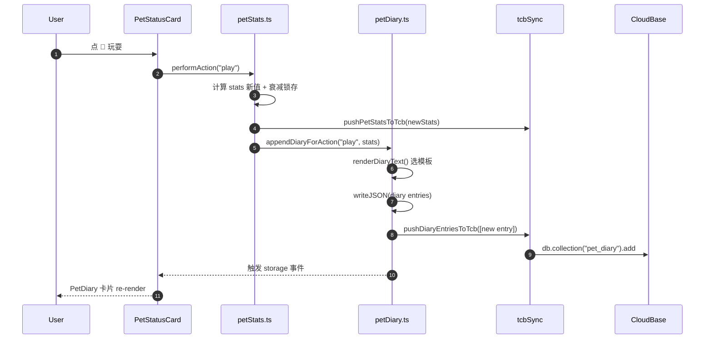
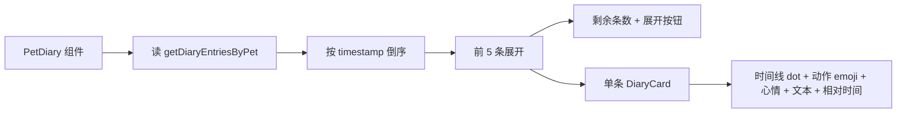
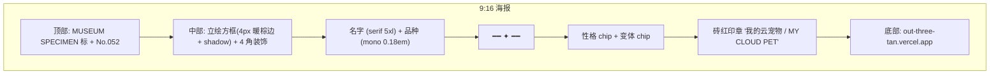
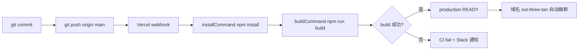
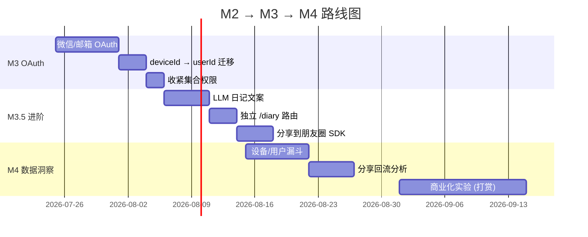

# Pet Atlas · M2 Release Note

> **完整 release note · 20+ 页 · 2026-07-20**
>
> 宠物大百科 M2 阶段交付总结。涵盖：互动 (A) + TCB 同步 (.5) + 日记 (B) + 分享 (D)。
>
> **读者**：投资人速览跳到 §1 / 协作者开发跳到 §10+11 / 未来自己回看跳到 §8 踩坑清单。

---

## 目录

| § | 章节 | 读者 | 时长 |
|---|------|------|------|
| 1 | [TL;DR](#1-tldr-一页速览) | 投资人/自己 | 2 min |
| 2 | [M2 阶段总览](#2-m2-阶段总览) | 全员 | 5 min |
| 3 | [M2.5 TCB 同步架构](#3-m25-tcb-同步架构) | 协作者/自己 | 10 min |
| 4 | [M2-A 宠物互动 (Pet Stats)](#4-m2-a-宠物互动) | 协作者 | 8 min |
| 5 | [M2-B 宠物日记 (Diary)](#5-m2-b-宠物日记) | 协作者 | 8 min |
| 6 | [M2-D 分享海报 (Share)](#6-m2-d-分享海报) | 协作者 | 5 min |
| 7 | [决策记录 (ADR)](#7-决策记录-adr) | 自己 | 10 min |
| 8 | [踩坑清单 (Lessons)](#8-踩坑清单-lessons-learned) | 自己 | 10 min |
| 9 | [测试 & 部署](#9-测试--部署-pipeline) | 协作者 | 5 min |
| 10 | [数据模型 (Schema)](#10-数据模型-schema) | 协作者 | 5 min |
| 11 | [API 表面 (M1/M2 函数)](#11-api-表面-m1m2-函数清单) | 协作者 | 8 min |
| 12 | [M3 路线图](#12-m3-路线图) | 投资人/自己 | 5 min |
| 13 | [附录](#13-附录) | 全员 | 3 min |

---

## 1. TL;DR (一页速览)

**M2 用了 2 天（2026-07-20 14:00 → 17:16），交付 4 个增量功能 + 1 个底层同步能力。**

| 阶段 | 功能 | 用户价值 | Commit | Vercel |
|------|------|----------|--------|--------|
| M2-A | 喂食/玩耍/休息 + 状态衰减 | 养成感 | `06494ae` | READY 15:04 |
| 导航 | Header + Hero + Footer 加入口 | 可发现性 | `9c4eb41` | READY 15:16 |
| M2.5 | TCB 浏览器匿名同步 | 跨设备 | `0dfb59d` | READY 15:46 |
| M2-B | 宠物日记（自动卡片） | 情感记录 | `8a38ce4` | READY 17:04 |
| M2-D | 分享海报（html2canvas） | 传播 | `dc9a272` | READY 17:16 |

**核心数据指标：**
- 51 品种 × 6 页图鉴（vintage paper 风格，306 张图）
- 51 品种 × 3 变体云宠物立绘（153 张图，TCB 全齐）
- 1 个 localStorage 数据层（cloudPet + petStats + petDiary 3 个 key）
- 3 个 TCB 集合（pet_stats / cloud_pets / pet_diary）
- 1 套发布管线（git push → Vercel auto-deploy → 域名跟新）

**在线体验：** https://out-three-tan.vercel.app

**核心架构（3 行总结）：**
1. **localStorage 主** — 即时反馈，无网络依赖
2. **TCB 兜底** — 跨设备同步，匿名 deviceId 标识
3. **静态站 + git push 部署** — 零运维，git 即产品

**商业角度（M2 完成 = 闭环可演示）：**
- 用户进来 → 看图鉴 → 领养云宠物 → 喂食玩耍 → 看见日记累积 → 截图分享朋友圈
- 全程 localStorage 即时反馈，TCB 跨设备备份
- 0 服务器成本（Vercel 静态 + TCB 按量）

---

## 2. M2 阶段总览

### 2.1 时间线

```
2026-07-20 14:00   M2-A 开始  (commit 06494ae)
2026-07-20 15:00   M2-A 上线  (Vercel READY)
2026-07-20 15:11   发现导航缺入口  → fix/nav-entries
2026-07-20 15:16   导航修复上线  (commit 9c4eb41)
2026-07-20 15:20   M2.5 开始  (commit 0dfb59d)
2026-07-20 15:46   M2.5 上线  (TCB 验证通过)
2026-07-20 16:50   M2-B 开始  (commit 8a38ce4)
2026-07-20 17:04   M2-B 上线  (TCB pet_diary 集合就绪)
2026-07-20 17:08   M2-D 开始  (commit dc9a272)
2026-07-20 17:16   M2-D 上线  (commit e779885 merge)
```

### 2.2 功能矩阵

| 能力 | M1 | M2-A | M2.5 | M2-B | M2-D |
|------|----|----|------|------|------|
| 选品种/起名/领养 | ✅ | | | | |
| 性格/颜色/变体 | ✅ | | | | |
| localStorage 持久化 | ✅ | | | | |
| 读图鉴解锁 reroll | ✅ | | | | |
| **状态条 (3 维)** | | ✅ | | | |
| **动作 (喂/玩/休)** | | ✅ | | | |
| **心情 (派生)** | | ✅ | | | |
| **TCB 跨设备同步** | | | ✅ | | |
| **匿名 deviceId** | | | ✅ | | |
| **离线容忍** | | | ✅ | | |
| **日记时间线** | | | | ✅ | |
| **event-driven 文案** | | | | ✅ | |
| **分享海报 (9:16)** | | | | | ✅ |
| **html2canvas 截图** | | | | | ✅ |

### 2.3 代码增量

```
M2-A    +574 lines  (lib/petStats + components/PetStatusCard)
导航     +69 lines  (Header + Footer + HeroPoster)
M2.5    +646 lines  (lib/tcb + tcbSync + deviceId)
M2-B    +573 lines  (lib/petDiary + components/PetDiary)
M2-D    +417 lines  (components/ShareModal)
──────────────────
合计   +2279 lines  (10 个新文件 + 6 个修改)
```

---

## 3. M2.5 TCB 同步架构

### 3.1 设计目标

- **零账号**：用户打开页面即用，零注册零登录
- **跨设备**：同一 deviceId 在任何浏览器都能看到自己的宠物
- **离线优先**：localStorage 永远是真的，云端是备份
- **失败容忍**：TCB 写失败不阻塞 UI，下一次拉新覆盖

### 3.2 数据流图



### 3.3 写入流程（写时 fire-and-forget）



### 3.4 读取流程（mount 时拉新合并）



### 3.5 关键设计决策

| 问题 | 决策 | 理由 |
|------|------|------|
| 鉴权方案 | 浏览器匿名登录 | 静态站唯一可用，避免 serverless |
| 存储后端 | TCB CloudBase Web SDK | 跟现有 COS bucket 共用环境 |
| 同步协议 | fire-and-forget + last-write-wins | UI 不阻塞，冲突简单粗暴 |
| deviceId 生成 | crypto.randomUUID() | 浏览器原生，永不变 |
| 离线检测 | navigator.onLine + online/offline 事件 | 标准 API，无需轮询 |
| TCB 集合 | 手动建（不能自动） | SDK add 静默失败，必须 console 手动 |

### 3.6 TCB 集合 Schema

```javascript
// collection: pet_stats
{
  deviceId: "uuid-xxx",           // 主键
  hunger: 0-100,
  energy: 0-100,
  happiness: 0-100,
  lastFedAt: 1234567890,
  lastPlayedAt: 1234567890,
  lastRestedAt: 1234567890,
  lastUpdatedAt: 1234567890,      // 冲突解决用
  _updateTime: server-side
}

// collection: cloud_pets
{
  deviceId: "uuid-xxx",
  petId: "uuid-yyy",
  petName: "豆豆",
  breedSlug: "labrador-retriever",
  breedZh: "拉布拉多寻回犬",
  breedCategory: "dog",
  personality: "curious" | "social" | "independent",
  colorPreference: "classic" | "cream" | "blue",
  variantIndex: 1 | 2 | 3,
  tcbUrl: "https://636c-.../cloud-pets/pool/labrador-retriever-v1.png",
  createdAt: 1234567890,
  _updateTime: server-side
}

// collection: pet_diary
{
  deviceId: "uuid-xxx",
  entryId: "uuid-zzz",            // 业务主键（本地生成）
  timestamp: 1234567890,
  actionType: "feed" | "play" | "rest" | "adopt",
  petSnapshot: { petId, petName, breedZh, mood },
  stats: { hunger, energy, happiness },
  text: "豆豆今天吃得很香...",
  _updateTime: server-side
}
```

### 3.7 升级路径 (M3+)



**迁移逻辑**：
1. 用户首次 OAuth 登录 → 把 deviceId 记录 copy 到 userId 名下
2. 旧 deviceId 数据保留（不清）
3. 查询用 `$or: [{deviceId}, {userId}]` 兼容
4. 未来 deviceId 标识「设备」，userId 标识「人」

---

## 4. M2-A 宠物互动

### 4.1 功能定义

- **3 维状态**：饱腹 (hunger) / 能量 (energy) / 心情 (happiness)，各 0-100
- **3 个动作**：喂食 (feed) / 玩耍 (play) / 休息 (rest)
- **自然衰减**：每状态每小时掉不同数值
- **派生心情**：6 种 mood (happy / calm / hungry / sleepy / bored / sad)
- **冷却机制**：每个动作 60s 冷却

### 4.2 状态机



### 4.3 数据层 API

```typescript
// web/lib/petStats.ts

export type PetStats = {
  hunger: number;
  energy: number;
  happiness: number;
  lastFedAt: number;
  lastPlayedAt: number;
  lastRestedAt: number;
  lastUpdatedAt: number;
};

export function getCurrentStats(): PetStats | null;  // 读时算衰减
export function performAction(action: "feed" | "play" | "rest"): ActionResult;
export function getCooldownRemaining(stats: PetStats | null, action): number;
export function deriveMood(stats: PetStats): Mood;  // 派生 6 种 mood
```

### 4.4 衰减计算

```typescript
// 读时算 elapsed,写时锁存
const elapsedHours = (now - lastUpdated) / 3_600_000;
const newHunger = clamp(saved.hunger - DECAY_PER_HOUR.hunger * elapsedHours);
```

| 状态 | 衰减/小时 | 满 → 空耗时 |
|------|-----------|-------------|
| hunger | 10 | 10h |
| energy | 8 | 12.5h |
| happiness | 5 | 20h |

### 4.5 动作效果

| 动作 | 主加成 | 副作用 | 冷却 |
|------|--------|--------|------|
| 🍖 喂食 | +35 hunger | +5 happiness | 60s |
| 🎾 玩耍 | +25 happiness | -15 energy | 60s |
| 💤 休息 | +40 energy | -5 hunger | 60s |

### 4.6 心情派生

```typescript
function deriveMood(stats): Mood {
  if (energy < 20) return "sleepy";      // 困了
  if (hunger < 25) return "hungry";     // 饿了
  if (happiness >= 70) return "happy";   // 开心
  if (happiness >= 45) return "calm";    // 平静
  if (happiness >= 25) return "bored";   // 无聊
  return "sad";                          // 难过
}
```

### 4.7 反馈文案（每动作 4 句随机）

```
喂食: "吃饱了,打了个小嗝~" / "嗯嗯好吃!谢谢主人" / "碗底都舔干净了" / "吃饱了想睡觉"
玩耍: "跑得飞起!摇尾巴了" / "在屋子里转圈圈" / "玩得超开心,眼睛亮了" / "叼着球跑给你看"
休息: "呼呼大睡,Zzz..." / "伸个懒腰,精神满满" / "闭眼休息中,别打扰" / "打了个小呼噜"
```

### 4.8 升级路径

- **M2.5 接入**：performAction 写后 fire-and-forget TCB
- **M3+**：动作效果跟 breed features 联动（不同品种偏好不同）

---

## 5. M2-B 宠物日记

### 5.1 功能定义

- **触发**：event-driven (喂/玩/休) + 领养时首条
- **存储**：localStorage + TCB 同步（沿用 M2.5 同步层）
- **文案**：模板字符串 + 变量替换
- **UI**：嵌入 /profile（时间线倒序卡片）
- **数据模型**：append-only，按 timestamp 倒序展示

### 5.2 事件流



### 5.3 数据模型

```typescript
// web/lib/petDiary.ts

export type DiaryEntry = {
  id: string;                  // uuid (业务主键)
  timestamp: number;           // ms
  actionType: "feed" | "play" | "rest" | "adopt";
  petSnapshot: {
    petId: string;
    petName: string;
    breedZh: string;
    mood: Mood;                // 触发时的 mood
  };
  stats: { hunger, energy, happiness };
  text: string;                // 模板渲染好的中文文案
  syncStatus?: "pending" | "synced" | "error";
};

// MAX 200 entries/pet (防 localStorage 爆)
```

### 5.4 文案模板

```typescript
const TEMPLATES: Record<DiaryActionType, string[]> = {
  adopt: [
    "今天从图鉴里把 {name} 领回家了!一只 {breed},{moodEmoji}。",
    "在 51 个品种里挑中了 {name}({breed}),它 {moodEmoji} 地看着我。",
  ],
  feed: [
    "{name} 狼吞虎咽地吃完了饭,碗底都舔干净了。饱腹度+{delta},{moodEmoji}。",
    "喂了 {name} 一顿,吃得超香,打了个小嗝~ {moodEmoji}",
  ],
  play: [...],
  rest: [...]
};
```

### 5.5 UI 设计



### 5.6 升级路径

- **M3+**：上 LLM 写更生动的文案（基于最近 N 条 + 品种特征 prompt）
- **M3+**：独立 /diary 路由（全文搜索 / 按动作筛选）
- **M3+**：分享海报用最近 5 条 entry

---

## 6. M2-D 分享海报

### 6.1 功能定义

- **触发位置**：/profile "🎁 分享我的云宠物" 按钮
- **技术方案**：html2canvas-pro 客户端截图
- **卡片尺寸**：9:16 比例（720x1280 内部坐标系，scale 2 高清导出）
- **导出**：下载 PNG（移动端长按，桌面端自动下载）
- **样式**：vintage paper 风格延续

### 6.2 海报布局



### 6.3 实现要点

```typescript
// 动态 import 避免 SSR polyfill
const { default: html2canvas } = await import("html2canvas-pro");
const canvas = await html2canvas(posterRef.current, {
  backgroundColor: "#F5EFE0",
  scale: 2,           // 高清
  useCORS: true,      // TCB 图片 CORS
});
const blob = await new Promise(r => canvas.toBlob(r, "image/png", 0.95));
const url = URL.createObjectURL(blob);
// 触发下载
const a = document.createElement("a");
a.href = url;
a.download = `pet-atlas-${pet.petName}-${Date.now()}.png`;
a.click();
```

### 6.4 升级路径

- **M3+**：Web Share API（移动端调起系统分享面板）
- **M3+**：微信 SDK 分享朋友圈（需开放平台）
- **M3+**：海报主题切换（新春/圣诞/生日/节气）

---

## 7. 决策记录 (ADR)

### ADR-001：鉴权方案选 CloudBase Web SDK + 匿名登录

**状态**：✅ 实施

**背景**：静态站（Next.js `output: export`）无法用 serverless，必须用浏览器侧 auth。

**选项**：
- A. CloudBase Web SDK + 匿名登录 ← 选
- B. COS + 临时 token（需后端签发）
- C. 无 auth，纯 localStorage（M1 现状）

**决策**：选 A。

**理由**：
- 浏览器匿名登录零门槛，符合"打开即用"理念
- 跟现有 COS bucket 共用 TCB 环境
- 未来上 OAuth 时 storage 层不用改（接口稳定）

**后果**：
- 需 TCB 控制台手动开"匿名登录"和建集合
- 跨设备靠 deviceId（人话：换浏览器是新用户）

---

### ADR-002：同步策略 fire-and-forget + last-write-wins

**状态**：✅ 实施

**背景**：3 个数据流（pet_stats / cloud_pets / pet_diary）需要本地/云端同步。

**选项**：
- A. fire-and-forget + last-write-wins ← 选
- B. 双向 sync queue (OT/CRDT)
- C. 服务端事件总线 (SSE)

**决策**：选 A。

**理由**：
- 单设备单用户，无 OT/CRDT 复杂场景
- last-write-wins 简单粗暴足够
- fire-and-forget 不阻塞 UI，失败容忍
- 离线时本地累积，恢复后自动 sync

**后果**：
- 短时间多设备并发写可能丢更新（接受）
- TCB 写失败只 console.warn，UI 无感（接受）

---

### ADR-003：deviceId 永不变 + 未来绑 userId

**状态**：✅ 实施

**背景**：跨设备同步需要一个稳定的标识。

**选项**：
- A. crypto.randomUUID() 永不变，OAuth 时绑 userId ← 选
- B. 每次 OAuth 重新生成 deviceId
- C. 用 IP+UA 哈希

**决策**：选 A。

**理由**：
- UUID 标准，浏览器原生
- 永不变 = 数据稳定
- OAuth 升级路径：`where($or: [{deviceId}, {userId}])` 兼容

**后果**：
- 清缓存 = 换 deviceId = 数据看起来"丢"（设计如此）
- OAuth 时需要写迁移脚本

---

### ADR-004：TCB 集合权限"所有登录用户可读写"（暂时）

**状态**：⏳ 临时

**背景**：M2.5 阶段 3 个集合需要权限设置。

**选项**：
- A. 所有登录用户可读写 ← 选（暂时）
- B. 仅创建者可读写（deviceId 字段鉴权）
- C. 公开读 + 仅创建者写

**决策**：选 A（M2.5 阶段），M3 收紧到 B。

**理由**：
- 匿名用户无真实身份，A/C 都不可用
- B 需要 TCB 自定义规则，复杂度高
- M2.5 阶段数据安全靠"deviceId 难猜"提供一层弱保护

**后果**：
- 任何登录用户能读写所有记录（理论）
- 实际：deviceId 是 UUID v4（122 bit 熵），不可枚举
- M3 加 OAuth 后收紧

---

### ADR-005：UI 风格 vintage paper museum specimen card

**状态**：✅ 实施

**背景**：项目整体视觉调性。

**决策**：
- 主色：oat #F5EFE0 + warm brown #8B6F47
- 字体：Noto Serif SC (display) + Noto Sans SC (body) + JetBrains Mono (numbers)
- 装饰：手绘植物、印章、罗马数字、衬线画框

**理由**：
- "标本卡"主题贴 51 品种的"博物馆展品"定位
- 暖色 vs AI 紫色渐变（拒绝工业化）

**后果**：
- 全栈设计 tokens（`globals.css`）一致
- 所有 UI 必须 vintage 调性

---

### ADR-006：Vercel 静态站 + git push 自动部署

**状态**：✅ 实施

**背景**：从 CLI 上传迁到 git 部署。

**决策**：
- Vercel 项目 rootDirectory: "web"
- buildCommand: "npm run build"
- outputDirectory: "out"
- 域名 out-three-tan.vercel.app 跟 production 自动

**理由**：
- 绕过 Vercel 5000 upload/天 限制
- 标准 CI/CD，git log 即发布历史
- 零运维

**后果**：
- 每次 git push 触发 30s 部署
- preview URL 走 Vercel SSO（custom domain 不影响）

---

## 8. 踩坑清单 (Lessons Learned)

### L1: VINTAGE_PAPER_DONE fallback bug

**症状**：本地只有 1 个 breed PNG，hero 组件 fallback 到 1 张图

**根因**：`web/lib/pets.ts` 的 `findSupportedBreeds()` 优先用本地扫描，本地有残留时不分情况

**修法**：
```ts
if (ATLAS_BASE_URL) {
  return new Set(VINTAGE_PAPER_DONE);  // TCB 模式强制白名单
}
```

**预防**：fallback 条件不应依赖本地状态（本地是临时，远端是源）

---

### L2: 相似品种混淆（Malamute/Husky）

**症状**：给 alaskan-malamute 跑图谱，AI 生成出 Siberian Husky（瘦/尖脸/蓝眼/镰刀尾 vs 粗壮/宽头/棕眼/卷尾）

**根因**：通用 prompt 只说 "a real Alaskan Malamute"，无显式特征词 → 默认走更常见的 Husky

**修法**：
1. Prompt 加 "CRITICAL: The dog MUST be unmistakably an ALASKAN MALAMUTE, not a Siberian Husky"
2. 列 6 个 Malamute 必备特征
3. 列 4 个禁止生成的 Husky 特征
4. 用同品种另一张已验证的图作 `input_file_paths` reference

**预防清单**（任何"相似品种对"）：
- 显式区分（not X, must Y）
- 必备特征 5-8 条 + 禁用特征 3-5 条
- reference 图锁住外观
- 6 张图都跑完后抽查 1-2 张

---

### L3: TCB 集合不自动建（SDK 静默失败）

**症状**：`add()` 不抛异常，返回 `{requestId}` 但无 `_id`；query 返回空 list

**根因**：CloudBase Web SDK 静默吞了 `DATABASE_COLLECTION_NOT_EXIST` 错误

**检测**：
```js
if (r.data?.code === "DATABASE_COLLECTION_NOT_EXIST") {
  // 集合不存在,不是空 list
}
```

**修法**：必须手动在 TCB 控制台建集合（跟 pet_stats/cloud_pets 一样）

---

### L4: TCB 匿名登录"已开启"但 SDK 报 login_type_disabled

**症状**：控制台 UI 显示"匿名登录·已启用"，Node 端调 `auth.signInAnonymously()` 报 4045

**根因**：UI 状态跟 TCB 后端状态不一致（改完没刷，或开了没真保存）

**修法**：
1. UI 没保存 → 重进控制台"登录方式"→ 确认开关开 + 显式保存
2. 关闭页面重开 → 重测
3. 仍失败 → 等 1-2 分钟（CDN 缓存）

**预防**：永远不只信 UI 状态，必须 Node 端验真

---

### L5: @cloudbase/js-sdk 顶层 import 触发 Node polyfill 错

**症状**：
```
Module not found: Can't resolve 'ws'
import * as i from "ws"; import * as o from "web-streams-polyfill";
```

**根因**：SDK 默认 import 拉了 Node 版（带 ws + web-streams-polyfill polyfill），浏览器 bundle 缺包

**修法**：必须 **dynamic import** 在函数体内：
```ts
async function getApp() {
  const { default: cloudbase } = await import("@cloudbase/js-sdk");
  // ...
}
```

**适用**：任何 isomorphic 库（分 node/browser entry）走 Next.js 都要 dynamic

---

### L6: Vercel CLI `vercel env pull` 覆盖 .env.local

**症状**：跑过 `vercel env pull` 后，根目录 `.env.local` 被覆盖成只剩 VERCEL_OIDC_TOKEN，原 TCB 凭据丢失

**根因**：`vercel env pull` 默认写入 `.env.local`，覆盖式

**修法**：
1. 跑 `vercel env pull` 前备份原 `.env.local`
2. 或者用 API 改 Vercel env（`PATCH /v10/projects/{id}/env`）不污染本地

---

### L7: 工作流 build 缺 NEXT_PUBLIC_ATLAS_BASE_URL 报 generateStaticParams 错

**症状**：worktree 跑 `npm run build` 报
```
Error: Page "/pets/[slug]/atlas" is missing "generateStaticParams()"
```

**根因**：worktree 没有 .env.local，ATLAS_BASE_URL undefined，TCB fallback 不触发，findSupportedBreeds 返回空集

**修法**：
```bash
export NEXT_PUBLIC_ATLAS_BASE_URL="https://636c-.../pet-atlas/atlas"
export NEXT_PUBLIC_CLOUD_PET_BASE_URL="https://636c-.../pet-atlas"
export NEXT_PUBLIC_TCB_ENV_ID="cloud1-..."
npm run build
```

**预防**：任何 worktree 跑 build 前 export 这 3 个 env 变量

---

### L8: 静态站 + CloudBase Web SDK 的 browser polyfill 错（多 worktree 偶发）

**症状**：`next build` 偶发报 `Module not found: Can't resolve 'ws'`

**根因**：Next.js 16 Turbopack 多 worktree 共享 lockfile，依赖解析可能串

**修法**：
1. worktree 单独 `npm install`
2. 跑前 export 上面 L7 的 env

---

## 9. 测试 & 部署 Pipeline

### 9.1 测试脚本

| 脚本 | 用途 | 状态 |
|------|------|------|
| `web/scripts/test-tcb-sync.mjs` | 验 pet_stats + cloud_pets 写读链路 | ✅ 通过 |
| `web/scripts/test-tcb-diary.mjs` | 验 pet_diary 写读链路 | ✅ 通过 |
| `web/scripts/diag-tcb-env.mjs` | 深度诊断 TCB 状态 | ✅ 工具 |
| `web/scripts/test-tcb-cols-real.mjs` | 检查集合存在性 | ✅ 工具 |

### 9.2 跑测试

```bash
cd web
export PATH="/opt/homebrew/bin:$PATH"
export NEXT_PUBLIC_TCB_ENV_ID="cloud1-d9gv1q8ikad5e9721"
node scripts/test-tcb-sync.mjs    # 5/5 绿
node scripts/test-tcb-diary.mjs   # 5/5 绿
```

### 9.3 部署 Pipeline



### 9.4 Vercel 配置

```json
{
  "rootDirectory": "web",
  "framework": "nextjs",
  "buildCommand": "npm run build",
  "installCommand": "npm install",
  "outputDirectory": "out",
  "env": {
    "NEXT_PUBLIC_ATLAS_BASE_URL": "https://636c-cloud1-.../pet-atlas/atlas",
    "NEXT_PUBLIC_CLOUD_PET_BASE_URL": "https://636c-cloud1-.../pet-atlas",
    "NEXT_PUBLIC_TCB_ENV_ID": "cloud1-d9gv1q8ikad5e9721"
  }
}
```

### 9.5 CI Workflow

`.github/workflows/ci.yml`：
- 2 jobs: build+tsc+diagnostic, lint markdown
- Vercel 是真部署，CI 是诊断（不阻塞）
- 故意 set +e + exit 0 + ::warning::

---

## 10. 数据模型 (Schema)

### 10.1 localStorage Keys

```
pet-atlas:device-id:v1     → uuid (主键,永不变)
pet-atlas:cloud-pet:v1     → CloudPet (当前领养的 1 个)
pet-atlas:pet-stats:v1     → PetStats (3 维状态)
pet-atlas:reroll:v1        → RerollState (1 免费 + 读图鉴解锁)
pet-atlas:breed-reads:v1   → BreedReadRecord (slug → 次数)
pet-atlas:pet-diary:v1     → DiaryEntry[] (append-only)
```

### 10.2 localStorage 数据结构

```typescript
// CloudPet
{
  petId: string;          // uuid
  breedSlug: string;
  breedZh: string;
  breedCategory: "dog" | "cat" | "small-mammal" | "bird" | "reptile";
  petName: string;        // 2-6 字中文
  personality: "curious" | "social" | "independent";
  colorPreference: "classic" | "cream" | "blue";
  variantIndex: 1 | 2 | 3;
  tcbUrl: string;
  createdAt: number;
}

// PetStats
{
  hunger: number;         // 0-100
  energy: number;
  happiness: number;
  lastFedAt: number;      // ms timestamp
  lastPlayedAt: number;
  lastRestedAt: number;
  lastUpdatedAt: number;
}

// RerollState
{
  used: number;
  unlocked: number;       // 1-3
  max: 3;
}

// DiaryEntry (见 §5.3)
```

### 10.3 TCB 集合 (见 §3.6)

---

## 11. API 表面 (M1/M2 函数清单)

### 11.1 领养 (cloudPet.ts)

```typescript
getAdoptedPet(): CloudPet | null
saveAdoptedPet(pet: CloudPet): void
clearAdoptedPet(): void
generatePetId(): string

// Reroll
getRerollState(): RerollState
setRerollState(state: RerollState): void
consumeReroll(): boolean
unlockRerollByReading(): RerollState
canReroll(): boolean
remainingRerolls(): number

// 读图鉴
getBreedReads(): BreedReadRecord
recordBreedRead(slug: string): void

// 同步
syncCloudPetFromTcb(): Promise<CloudPet | null>

// 显示
PERSONALITY_LABEL: Record<Personality, string>
COLOR_LABEL: Record<ColorPreference, string>
```

### 11.2 互动 (petStats.ts)

```typescript
getCurrentStats(): PetStats | null
performAction(action: "feed" | "play" | "rest"): ActionResult
getCooldownRemaining(stats: PetStats | null, action): number
deriveMood(stats: PetStats): Mood
clearPetStats(): void
syncFromTcb(): Promise<PetStats | null>
MOOD_META: Record<Mood, { emoji, label, description, color }>
```

### 11.3 日记 (petDiary.ts)

```typescript
getAllDiaryEntries(): DiaryEntry[]
getDiaryEntriesByPet(petId: string): DiaryEntry[]
appendDiaryEntry(action, pet, stats, mood): DiaryEntry
clearDiaryForPet(petId: string): void
markDiarySynced(ids: string[]): void
relativeTime(timestamp: number, now?: number): string
ACTION_META: Record<DiaryActionType, { emoji, label, color }>
```

### 11.4 TCB 同步 (tcbSync.ts)

```typescript
isTcbConfigured(): boolean
getDatabase(): Promise<any | null>
resetTcb(): void

// pet_stats
fetchPetStatsFromTcb(): Promise<PetStats | null>
pushPetStatsToTcb(stats: PetStats): Promise<boolean>

// cloud_pets
fetchCloudPetFromTcb(): Promise<CloudPet | null>
pushCloudPetToTcb(pet: CloudPet): Promise<boolean>
deleteCloudPetFromTcb(): Promise<boolean>

// pet_diary
fetchDiaryEntriesFromTcb(): Promise<DiaryEntry[]>
pushDiaryEntriesToTcb(entries: DiaryEntry[]): Promise<string[]>

// 状态
getSyncStatus(): SyncStatus
onSyncStatusChange(fn: (s: SyncStatus) => void): () => void
setupNetworkListeners(): void
teardownNetworkListeners(): void
```

### 11.5 Device ID (deviceId.ts)

```typescript
getDeviceId(): string | null
resetDeviceId(): string | null
```

---

## 12. M3 路线图

### 12.1 时间线（建议）



### 12.2 M3 优先级

| P | 内容 | 依赖 |
|---|------|------|
| **P0** | 微信/邮箱 OAuth + deviceId 迁移 | TCB 已有 |
| **P0** | 收紧 TCB 集合权限（userId 鉴权） | P0 第一个 |
| **P1** | LLM 写更生动的日记文案 | 模板+特征+LLM API |
| **P1** | 独立 /diary 路由（搜索/筛选/分页） | 已有数据 |
| **P2** | 微信 SDK 分享朋友圈 | 开放平台 |
| **P2** | 数据洞察 + 商业化 | P0/P1 都完成后 |

### 12.3 商业化可能路径

- **打赏/订阅**：vintage 主题包、稀有立绘、装饰
- **数据洞察**：用户行为 → 选品推荐
- **B2B 衍生**：博物馆/教育/出版合作
- **白标**：给其他宠物品牌做"图鉴+养成"引擎

---

## 13. 附录

### 13.1 关键链接

- **线上地址**：https://out-three-tan.vercel.app
- **GitHub**：https://github.com/mishishi/pet-atlas
- **Vercel Dashboard**：https://vercel.com/mishishis-projects/pet-receiver
- **TCB 控制台**：https://console.cloud.tencent.com/tcb (env: cloud1-d9gv1q8ikad5e9721)
- **COS Bucket**：636c-cloud1-d9gv1q8ikad5e9721-1442530204

### 13.2 关键命令

```bash
# 开发
cd web && npm install && npm run dev

# 跑 TCB 链路测试
cd web
export NEXT_PUBLIC_TCB_ENV_ID="cloud1-d9gv1q8ikad5e9721"
node scripts/test-tcb-sync.mjs
node scripts/test-tcb-diary.mjs

# 本地 build 验证
cd web
export PATH="/opt/homebrew/bin:$PATH"
export NEXT_PUBLIC_ATLAS_BASE_URL="https://636c-cloud1-.../pet-atlas/atlas"
export NEXT_PUBLIC_CLOUD_PET_BASE_URL="https://636c-cloud1-.../pet-atlas"
export NEXT_PUBLIC_TCB_ENV_ID="cloud1-d9gv1q8ikad5e9721"
npm run build

# 部署
git push origin main  # Vercel auto-deploys

# 重新部署特定 commit
# Vercel Dashboard → Deployments → Promote to Production

# 备份 localStorage 数据（开发期）
# 浏览器 devtools → Application → Local Storage → 复制
```

### 13.3 文件清单（M2 新增）

```
web/lib/petStats.ts               (338 lines) · M2-A 状态数据层
web/components/cloud-pet/PetStatusCard.tsx  (225 lines) · M2-A 状态卡 UI
web/lib/tcb.ts                    (62 lines) · M2.5 CloudBase 懒加载
web/lib/tcbSync.ts                (302 lines) · M2.5 + B 同步适配器
web/lib/deviceId.ts               (45 lines) · M2.5 UUID 主键
web/lib/petDiary.ts               (210 lines) · M2-B 日记数据层
web/components/cloud-pet/PetDiary.tsx  (160 lines) · M2-B 日记 UI
web/components/cloud-pet/ShareModal.tsx  (349 lines) · M2-D 分享海报
```

### 13.4 内存记录

详见 `~/.mavis/agents/mavis/memory/MEMORY.md` 的：
- `pet-atlas M2-A` (互动)
- `pet-atlas M2.5 TCB` (同步层)
- `pet-atlas M2-B` (日记)
- `TCB 匿名登录报 login_type_disabled` (踩坑)
- `pet-atlas VINTAGE_PAPER_DONE fallback` (踩坑)
- `pet-atlas 相似品种混淆` (踩坑)
- `pet-atlas Vercel git 部署配置` (部署)
- `pet-atlas British-shorthair v1/v2 立绘` (内容补全)

### 13.5 致谢

- 设计：Mavis (AI partner) + Jason 共同构思
- 内容：51 品种 6 页图鉴文案 + 51 × 3 变体立绘 prompt
- 部署：Vercel + 腾讯云 CloudBase
- 用户测试：Jason

---

**M2 完成。** 下一步 M3 OAuth 走起。 🚀

*文档版本：v1.0 · 2026-07-20 17:30 · commit e779885*
